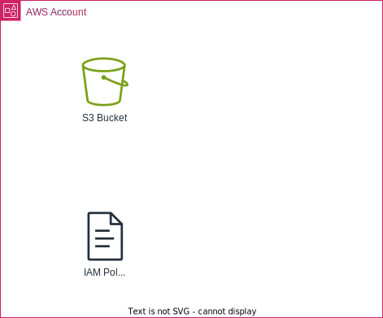

# Rerraform AWS log S3 Bucket

This terraform module create Terraform Backend using Amazon S3 to store tfstate.

## Resource Overview




## How To Use

```sh
terraform init
terraform plan
terraform apply
```

## How To Develop

### Prerequisite

- tenv
- terraform
- TFLing
- Trivy
- checkov
- terraform-docs
- pre-commit-terraform

### Commands

```sh
terraform fmt
terraform init
terraform validate
terraform tflint
terraform trivy
terraform checkov
terraform test
terraform plan
terraform-docs
pre-commit-terraform
terraform
```

```sh
terraform-docs markdown table --output-file README.md --output-mode inject .
```

```sh
pre-commit run -a
```


### Test

- [Tests - Configuration Language | Terraform | HashiCorp Developer](https://developer.hashicorp.com/terraform/language/tests)
- [Write Terraform Tests | Terraform | HashiCorp Developer](https://developer.hashicorp.com/terraform/tutorials/configuration-language/test)
- [Testing HashiCorp Terraform](https://www.hashicorp.com/ja/blog/testing-hashicorp-terraform)
- [Terraformテスト入門 - Speaker Deck](https://speakerdeck.com/msato/terraform-test)


### Naming Rule

- terraform
- aws


<!-- BEGIN_TF_DOCS -->
## Requirements

| Name | Version |
|------|---------|
| <a name="requirement_terraform"></a> [terraform](#requirement\_terraform) | >= 1.11.0 |
| <a name="requirement_aws"></a> [aws](#requirement\_aws) | >= 5.83 |

## Providers

No providers.

## Modules

| Name | Source | Version |
|------|--------|---------|
| <a name="module_s3"></a> [s3](#module\_s3) | ./modules/s3-bucket | n/a |
| <a name="module_iam_policy"></a> [iam\_policy](#module\_iam\_policy) | ./modules/iam-policy | n/a |

## Resources

No resources.

## Inputs

| Name | Description | Type | Default | Required |
|------|-------------|------|---------|:--------:|
| <a name="input_env"></a> [env](#input\_env) | The environment to create resources in | `string` | n/a | yes |
| <a name="input_product"></a> [product](#input\_product) | The product to create resources for | `string` | n/a | yes |
| <a name="input_usage"></a> [usage](#input\_usage) | The usage to create resources for | `string` | `"logs"` | no |
| <a name="input_region"></a> [region](#input\_region) | The region to create resources in | `string` | n/a | yes |
| <a name="input_suffix"></a> [suffix](#input\_suffix) | The suffix to append to S3 Bucket | `string` | n/a | yes |
| <a name="input_log_type"></a> [log\_type](#input\_log\_type) | The type of logs to store in the bucket (awsservice, awswaf, network, access, application, audit, security, system, service, other) | `string` | n/a | yes |
| <a name="input_enable_force_destroy"></a> [enable\_force\_destroy](#input\_enable\_force\_destroy) | A boolean that indicates all objects should be deleted from the bucket so that the bucket can be destroyed without error | `bool` | `false` | no |
| <a name="input_tags"></a> [tags](#input\_tags) | The tags to assign to the resources | `map(string)` | `{}` | no |
| <a name="input_enable_object_lock"></a> [enable\_object\_lock](#input\_enable\_object\_lock) | A boolean that indicates whether object lock is enabled | `bool` | `false` | no |
| <a name="input_sse_algorithm"></a> [sse\_algorithm](#input\_sse\_algorithm) | The server side encryption algorithm | `string` | `"AES256"` | no |
| <a name="input_enable_sse_bucket_key"></a> [enable\_sse\_bucket\_key](#input\_enable\_sse\_bucket\_key) | A boolean that indicates whether server side encryption is enabled | `bool` | `false` | no |
| <a name="input_kms_master_key_id"></a> [kms\_master\_key\_id](#input\_kms\_master\_key\_id) | The KMS master key ID | `string` | `null` | no |
| <a name="input_enable_lifecycle"></a> [enable\_lifecycle](#input\_enable\_lifecycle) | A boolean that indicates whether lifecycle is enabled | `bool` | `true` | no |
| <a name="input_lifecycle_filter_prefix"></a> [lifecycle\_filter\_prefix](#input\_lifecycle\_filter\_prefix) | The filter prefix for the lifecycle rule | `string` | `"logs/"` | no |
| <a name="input_lifecycle_pattern"></a> [lifecycle\_pattern](#input\_lifecycle\_pattern) | The lifecycle pattern (default, short, long) | `string` | `null` | no |
| <a name="input_logging_target_bucket"></a> [logging\_target\_bucket](#input\_logging\_target\_bucket) | The target bucket for access logs | `string` | `null` | no |
| <a name="input_logging_target_prefix"></a> [logging\_target\_prefix](#input\_logging\_target\_prefix) | The target prefix for access logs | `string` | `null` | no |
| <a name="input_custom_iam_policy_name"></a> [custom\_iam\_policy\_name](#input\_custom\_iam\_policy\_name) | The name of the IAM policy which grants access to the S3 bucket | `string` | `null` | no |

## Outputs

| Name | Description |
|------|-------------|
| <a name="output_s3"></a> [s3](#output\_s3) | output of s3 bucket |
| <a name="output_iam"></a> [iam](#output\_iam) | output of iam policy |
<!-- END_TF_DOCS -->
